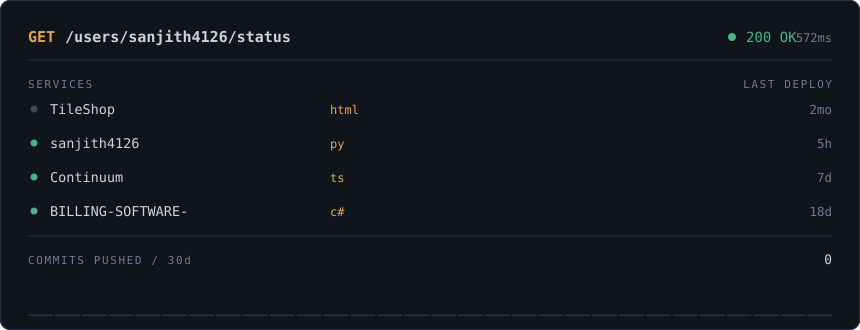

<!--
  Edit THIS file, not README.md.
  README.md is generated by scripts/build_profile.py — anything you type there
  gets overwritten on the next scheduled run.
-->

  

<h3 align="center">S. Sanjith</h3>

  Backend-leaning full stack &nbsp;·&nbsp; C# / ASP.NET Core &nbsp;·&nbsp; Python / Django 
  B.E. Computer Science &rsquo;28 &nbsp;·&nbsp; Coimbatore, India

  <a href="https://linkedin.com/in/sanjith-s04">LinkedIn</a> &nbsp;·&nbsp;
  <a href="mailto:ssanjithsan@gmail.com">Email</a> &nbsp;·&nbsp;
  <a href="#post-guestbook">Sign the guestbook</a>

---

> **The board above is not a widget.** It is drawn by
> [`scripts/build_profile.py`](scripts/build_profile.py) — ~250 lines that call the GitHub
> REST API, bucket my push events by day, and emit the SVG from scratch. A
> [scheduled workflow](.github/workflows/build-profile.yml) runs it every six hours and commits the
> result. No third-party service renders any part of this profile.

### Currently shipping

<!--BUILD:NOW-->
- **TileShop** — no description set `html` · last push 12d ago
- **sanjith4126** — no description set `py` · last push 6h ago
- **time-table-generator-N8n-** — no description set `—` · last push 5mo ago
<!--/BUILD:NOW-->

---

<b><code>GET</code> /experience</b> &nbsp;— where I've written code that other people depend on

 

**Software Developer Intern, Team Lead** — Saint-Gobain SEFPRO, Kanjikode · 2026 · 3 months

Led a 5-person Agile team through the full SDLC to deliver a **5S Audit Management System**,
retiring a manual spreadsheet process and a 29-page Power BI report.

- JWT-secured REST APIs in **ASP.NET Core 10**, role-based access control across 6 roles
- Normalised **PostgreSQL** schema via **Entity Framework Core**
- Corrective-action tracking, automated email reminders, background job scheduling, Excel/PDF export
- **React 19** dashboards with Chart.js reproducing the legacy Power BI analytics live
- Unit tests in xUnit and Vitest; Git throughout

**Full Stack Python Intern** — Accent Technosoft, Coimbatore · Aug–Oct 2025

Django features end to end — backend business logic, MySQL through raw SQL and the Django ORM,
frontend components wired to backend endpoints.

<b><code>GET</code> /projects</b> &nbsp;— things that exist because I built them

 

**TileShop** — production e-commerce storefront, paid freelance client (Suwasthick Tiles)
`Django` `Django ORM` `SQLite` `Tailwind` `Gemini API` `Pillow`

- Product/order relational schema, catalog filtering by category and material, session cart
- Multi-step checkout with an order-status workflow: pending → confirmed → shipped → delivered
- **AI Room Visualizer** — renders a chosen tile onto a photo of the customer's own room via
  Google's Gemini image API. The feature no competing tile retailer in the region has.
- Production hardening: HSTS, CSRF, secure cookies, upload limits, customised Django Admin so
  the client manages their own inventory

**College Timetable Automation** — `n8n` `JavaScript`

Constraint solver over Excel data — no duplicate subjects per class, no session clashes — with a
plain HTML/CSS/JS frontend rendering the generated schedules.

<b><code>GET</code> /stack</b> &nbsp;— honest inventory, no logo wall

 

| Layer | What I reach for | Also used |
|---|---|---|
| Languages | C#, Python | Java, JavaScript, C, SQL |
| Backend | ASP.NET Core, Django | Spring Boot, Blazor |
| Data | PostgreSQL, EF Core, Django ORM | MySQL, SQLite |
| Frontend | React, Tailwind | Vite, Chart.js |
| Practice | REST design, JWT + RBAC, xUnit, Git | Agile, n8n automation |

<b><code>GET</code> /education</b>

 

**B.E. Computer Science and Engineering** — Nehru Institute of Engineering and Technology
(Autonomous), Coimbatore · expected 2028 · CGPA 8.5 through semester 4

Winner, Paper Presentation — XOUZIA 2026 &nbsp;·&nbsp; Winner, Poster Making — ICNGTS 2025

---

### `POST` /guestbook

Open an issue titled **`/sign your message here`** and a workflow will parse it, append you below,
and close the issue. Entries appear after I approve them.

<!--BUILD:GUESTBOOK-->
_No entries yet. Open an issue titled `/sign <your message>` to leave one._
<!--/BUILD:GUESTBOOK-->

---

  <!--BUILD:STAMP-->
<code>last build: 04 Aug 2026, 08:00 IST &middot; run #52 &middot; 1030ms</code>
<!--/BUILD:STAMP-->

